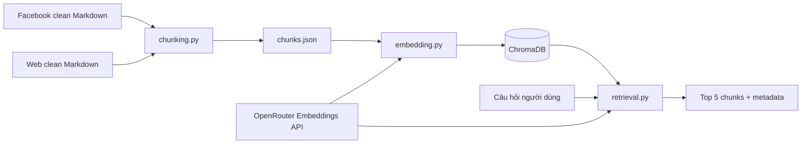

# Hệ thống RAG

Tài liệu này mô tả toàn bộ luồng xử lý dữ liệu của hệ thống RAG: đọc tài liệu sạch, chia chunk theo cấu trúc, tạo embedding, lưu ChromaDB và truy xuất top kết quả bằng cosine similarity.

## 1. Kiến trúc tổng thể



Luồng chính:

1. `chunking.py` đọc tài liệu Markdown trong hai nguồn Facebook và Web.
2. Tài liệu được chia theo cây đề mục, từ mục lớn đến mục nhỏ và mục con.
3. Các chunk được ghi vào `src/rag/chunks.json`.
4. `embedding.py` đọc từng chunk, gọi Embeddings API và lưu vector vào ChromaDB.
5. `retrieval.py` embedding câu hỏi người dùng bằng cùng model.
6. ChromaDB tìm các vector gần nhất bằng cosine similarity.
7. Hệ thống trả về mặc định 5 chunk phù hợp nhất, kèm metadata có giá trị.

## 2. Cấu trúc file

```text
VGO-K3-AI-Product-Hackathon/
├── .env
├── data/
│   ├── Data_FaceBook_ckean/
│   │   └── ai_thuc_chien_facebook_feedback_clean.md
│   └── web/
│       └── _clean/
│           ├── 20k-ai-handbook-final.md
│           ├── thong-tin-tuyen-sinh-....md
│           └── vingroup-tang-toc-....md
└── src/
    └── rag/
        ├── chunking.py
        ├── chunks.json
        ├── embedding.py
        ├── retrieval.py
        └── chroma_db/
```

Vai trò từng file:

| File/thư mục | Vai trò |
| --- | --- |
| `data/Data_FaceBook_ckean` | Dữ liệu feedback Facebook đã làm sạch |
| `data/web/_clean` | Dữ liệu website/PDF đã làm sạch dưới dạng Markdown |
| `src/rag/chunking.py` | Phân tích cấu trúc và tạo chunks |
| `src/rag/chunks.json` | Kết quả chunk trung gian, dùng để kiểm tra và embedding |
| `src/rag/embedding.py` | Gọi API embedding và upsert vào ChromaDB |
| `src/rag/retrieval.py` | Embedding câu hỏi và tìm top chunks |
| `src/rag/chroma_db` | Vector database lưu cục bộ |

## 3. Dữ liệu đầu vào

### 3.1. Nguồn Facebook

Thư mục:

```text
data/Data_FaceBook_ckean/**/*.md
```

Tên tài liệu dùng trong metadata được chuẩn hóa thành:

```text
feedback_nguoi_dung_tren_Facebook
```

### 3.2. Nguồn Web

Thư mục:

```text
data/web/_clean/**/*.md
```

Tên tài liệu trong metadata giữ nguyên tên file, gồm phần mở rộng `.md`.

### 3.3. Source link

Mỗi tài liệu phải khai báo source ở đầu file:

```markdown
<!-- source: https://example.com/tai-lieu -->
```

Nếu không có source ở đầu tài liệu, `chunking.py` dừng và báo lỗi. Quy tắc này bảo đảm mọi kết quả retrieval đều truy ngược được nguồn.

## 4. Cách chunk tài liệu

### 4.1. Phân cấp đề mục

Hệ thống hỗ trợ cấu trúc từ lớn đến nhỏ:

```text
I. MỤC LỚN
├── 1. Mục nhỏ
│   ├── 1.1. Mục con
│   │   ├── Gạch đầu dòng
│   │   └── Gạch đầu dòng
│   └── 1.2. Mục con
├── 2. Mục nhỏ
II. MỤC LỚN
└── ...
III. MỤC LỚN
└── ...
```

Các dạng tiêu đề được nhận diện:

- Markdown: `#`, `##`, `###`, `####`.
- Số La Mã: `I.`, `II.`, `III.`.
- Mục số: `1.`, `2.`, `3.`.
- Mục con: `1.1`, `1.2`, `2.1`.
- Tiêu đề in đậm Markdown, ví dụ `**I. THÔNG TIN CHUNG**`.
- Tiêu đề có nội dung cùng dòng, ví dụ `**1. Cơ sở đào tạo:** Trường Đại học VinUni.`.

### 4.2. Quy tắc theo loại tài liệu

Nếu tài liệu có cấu trúc La Mã:

- Số La Mã là `muc_lon`.
- Số nguyên là `muc_nho`.
- Số thập phân phân cấp là `muc_con`.

Nếu tài liệu không có cấu trúc La Mã:

- Heading Markdown cấp 2 là `muc_lon`.
- Heading Markdown cấp 3 là `muc_nho`.
- Heading Markdown cấp 4 trở xuống là `muc_con`.
- Heading cấp 1 được xem là tên tài liệu và không lặp lại trong mọi chunk.

Ví dụ FAQ Facebook:

```markdown
## 8. Chương trình có những track nào?

### AI Applications hoặc AI Engineer
```

Kết quả metadata:

```json
{
  "muc_lon": "8. Chương trình có những track nào?",
  "muc_nho": "AI Applications hoặc AI Engineer"
}
```

### 4.3. Đoạn văn và gạch đầu dòng

- Nội dung được gom theo section lá nhỏ nhất.
- Gạch đầu dòng được giữ nguyên thành đơn vị nội dung, không cắt giữa một bullet.
- Khi section quá dài, hệ thống ưu tiên cắt theo block, sau đó theo dòng, câu và cuối cùng theo từ.
- Breadcrumb của mục lớn, mục nhỏ và mục con được chèn vào đầu content để vector vẫn giữ ngữ cảnh.
- Kích thước mặc định tối đa gần đúng là 1.800 ký tự mỗi chunk.
- Có thể đổi giới hạn bằng `--max-chars`.

Ví dụ content sau khi chunk:

```markdown
# III. THÔNG TIN TUYỂN SINH CHI TIẾT
## 1. Đối tượng, điều kiện dự tuyển
### 1.2. Năng lực và phẩm chất cá nhân

- Có tư duy logic...
- Có động lực mạnh mẽ...
```

### 4.4. Chunk ID

Mỗi chunk có ID ổn định dạng:

```text
chunk_9286a7121125a5ea
```

ID được tạo từ SHA-1 của:

- Đường dẫn file nguồn.
- Mục lớn, mục nhỏ và mục con.
- Vị trí phần khi section bị chia nhỏ.
- Nội dung chunk.

Khi nội dung hoặc cấu trúc thay đổi, ID tương ứng cũng thay đổi.

## 5. Cấu trúc `chunks.json`

File JSON có dạng:

```json
{
  "total_documents": 4,
  "total_chunks": 82,
  "chunks": [
    {
      "id": "chunk_...",
      "content": "Nội dung chunk...",
      "metadata": {}
    }
  ]
}
```

### 5.1. Metadata của chunk

| Field | Kiểu | Ý nghĩa |
| --- | --- | --- |
| `muc_lon` | string hoặc null | Mục lớn gần nhất |
| `muc_nho` | string hoặc null | Mục nhỏ gần nhất |
| `muc_con` | string hoặc null | Mục con gần nhất |
| `ten_tai_lieu` | string | Tên tài liệu dùng để hiển thị |
| `source_link` | string | URL nguồn gốc |
| `loai_nguon` | string | `facebook` hoặc `web` |
| `source_file` | string | Đường dẫn file nguồn trong dự án |
| `chunk_index` | integer | Thứ tự chunk trong một tài liệu, bắt đầu từ 0 |
| `part_index` | integer | Thứ tự phần khi một section bị chia nhỏ, bắt đầu từ 1 |
| `global_chunk_index` | integer | Thứ tự chunk trong toàn bộ `chunks.json` |

Các field đề mục có thể là `null` nếu tài liệu không có cấp tương ứng.

## 6. Embedding

### 6.1. Cấu hình

`embedding.py` đọc cấu hình từ `.env`:

```env
EMBEDDING_API=<OPENROUTER_API_KEY>
EMBEDDING_MODEL=intfloat/multilingual-e5-large
EMBEDDING_BASE_URL=https://openrouter.ai/api/v1
EMBEDDING_BATCH_SIZE=8
EMBEDDING_TIMEOUT_SECONDS=60
EMBEDDING_MAX_RETRIES=4
EMBEDDING_DOCUMENT_PREFIX=passage:

CHUNKS_FILE=src/rag/chunks.json
CHROMA_DIR=src/rag/chroma_db
CHROMA_COLLECTION=ai_thuc_chien_chunks
```

Không ghi API key thật vào tài liệu hoặc commit Git. File `.env` đã được `.gitignore` bỏ qua.

Hai biến sau đang dành cho bước sinh câu trả lời bằng LLM, chưa được sử dụng trong chunking, embedding hoặc retrieval:

```env
OPENAI_API=<OPENROUTER_API_KEY>
OPENAI_MODEL=openai/gpt-4o-mini
```

### 6.2. Quy trình embedding

1. Đọc và kiểm tra schema `chunks.json`.
2. Kiểm tra ID không trùng và content không rỗng.
3. Thêm prefix `passage:` trước content gửi tới model E5.
4. Gửi nhiều chunk theo batch tới endpoint `/embeddings`.
5. Kiểm tra số vector, kiểu số và số chiều đồng nhất.
6. Upsert ID, content, vector và metadata vào ChromaDB.
7. Retry khi gặp timeout, rate limit hoặc lỗi server tạm thời.

Model hiện tại:

```text
intfloat/multilingual-e5-large
```

Vector thực tế có 1.024 chiều.

## 7. ChromaDB

### 7.1. Vị trí và collection

```text
Database:   src/rag/chroma_db
Collection: ai_thuc_chien_chunks
```

Chroma chạy bằng `PersistentClient`, nên dữ liệu tự động được lưu xuống ổ đĩa và được nạp lại ở lần chạy sau.

Collection dùng HNSW với metric:

```text
cosine
```

### 7.2. Dữ liệu lưu trong mỗi record

Mỗi record Chroma gồm:

- `id`: ID của chunk.
- `document`: content của chunk.
- `embedding`: vector 1.024 chiều.
- `metadata`: metadata từ `chunks.json` và field `embedding_model`.

Chroma không lưu các metadata có giá trị `null`. Những kiểu dữ liệu phức tạp ngoài kiểu Chroma hỗ trợ được chuyển thành chuỗi JSON.

### 7.3. Trạng thái hiện tại

Kết quả đối chiếu hiện tại:

| Kiểm tra | Kết quả |
| --- | ---: |
| Tổng chunks trong JSON | 82 |
| Tổng records trong ChromaDB | 82 |
| ID thiếu | 0 |
| ID thừa | 0 |
| Content sai khác | 0 |
| Metadata sai khác | 0 |
| Vector lỗi | 0 |
| Kích thước vector | 1.024 |

JSON và ChromaDB đang khớp hoàn toàn với nhau. Tuy nhiên, source Facebook trong file Markdown hiện không có dấu `/` cuối URL, còn 47 records trong `chunks.json` và ChromaDB giữ URL cũ có dấu `/`. Khác biệt này không ảnh hưởng nội dung hay embedding, nhưng cần chạy lại chunking và embedding nếu muốn metadata khớp tuyệt đối với file nguồn.

Phân bố theo nguồn:

| Nguồn | Số chunk |
| --- | ---: |
| Facebook feedback | 47 |
| `20k-ai-handbook-final.md` | 17 |
| Thông tin tuyển sinh | 14 |
| Bài viết Vingroup tăng tốc đào tạo | 4 |

## 8. Retrieval

### 8.1. Luồng truy xuất

1. Nhận câu hỏi người dùng.
2. Đọc `EMBEDDING_MODEL` từ `.env`.
3. Kiểm tra model trong `.env` trùng model của collection.
4. Thêm prefix `query:` trước câu hỏi.
5. Gọi API để tạo vector câu hỏi.
6. Gửi vector tới ChromaDB.
7. Chroma tìm top 5 theo cosine distance.
8. Chuyển distance thành similarity:

```text
cosine_similarity = 1 - cosine_distance
```

9. Trả kết quả theo cosine similarity giảm dần.
10. Loại metadata `null`, chuỗi rỗng, list rỗng và object rỗng.

### 8.2. Output retrieval

```json
{
  "question": "Chương trình học trong bao lâu?",
  "embedding_model": "intfloat/multilingual-e5-large",
  "returned_results": 5,
  "results": [
    {
      "rank": 1,
      "id": "chunk_9286a7121125a5ea",
      "cosine_similarity": 0.848624,
      "content": "# 5. Lộ trình 12 tuần...",
      "metadata": {
        "muc_lon": "5. Lộ trình 12 tuần được tổ chức như thế nào?",
        "ten_tai_lieu": "feedback_nguoi_dung_tren_Facebook",
        "source_link": "https://www.facebook.com/...",
        "loai_nguon": "facebook"
      }
    }
  ]
}
```

Metadata thực tế có thể có thêm field, nhưng field `null` không xuất hiện.

## 9. Lệnh sử dụng

### 9.1. Tạo lại chunks

```powershell
python src\rag\chunking.py
```

Đổi giới hạn kích thước:

```powershell
python src\rag\chunking.py --max-chars 1500
```

### 9.2. Kiểm tra chunks, không gọi API

```powershell
python src\rag\embedding.py --validate-only
```

### 9.3. Tạo embedding và lưu ChromaDB

```powershell
python src\rag\embedding.py
```

Xóa collection cũ và tạo lại hoàn toàn:

```powershell
python src\rag\embedding.py --recreate
```

`--recreate` xóa collection cùng tên trước khi embedding. Chỉ dùng khi muốn xây lại database hoặc khi cấu trúc chunk/model đã thay đổi.

### 9.4. Retrieval top 5

```powershell
python src\rag\retrieval.py "Chương trình học trong bao lâu?"
```

Nhập câu hỏi tương tác:

```powershell
python src\rag\retrieval.py
```

Đổi số kết quả:

```powershell
python src\rag\retrieval.py "Câu hỏi" --top-k 10
```

Output JSON một dòng:

```powershell
python src\rag\retrieval.py "Câu hỏi" --compact
```

## 10. Quy trình cập nhật dữ liệu

Khi thêm hoặc sửa tài liệu nguồn:

1. Đảm bảo file nằm đúng thư mục clean.
2. Đảm bảo dòng source ở đầu file.
3. Chạy lại `chunking.py`.
4. Kiểm tra `chunks.json`, số chunk và metadata.
5. Chạy `embedding.py --recreate` để loại bỏ record cũ không còn tồn tại.
6. Đối chiếu số chunk trong JSON với số record trong ChromaDB.
7. Chạy vài câu hỏi retrieval để kiểm tra chất lượng thực tế.

Luồng cập nhật khuyến nghị:

```powershell
python src\rag\chunking.py
python src\rag\embedding.py --validate-only
python src\rag\embedding.py --recreate
python src\rag\retrieval.py "Câu hỏi kiểm tra"
```

Không dùng `embedding.py` không có `--recreate` sau khi xóa hoặc thay đổi nhiều chunk. Chế độ mặc định dùng `upsert`, nên record cũ có ID không còn xuất hiện trong `chunks.json` sẽ không tự bị xóa.

## 11. Kiểm tra và xử lý lỗi

### API chạy lâu nhưng chưa có kết quả

- `embedding.py` in log sau khi một batch được lưu.
- `retrieval.py` in trạng thái trước khi gọi API.
- Có thể giảm `EMBEDDING_BATCH_SIZE` hoặc tăng `EMBEDDING_TIMEOUT_SECONDS` nếu API chậm.

Ví dụ:

```env
EMBEDDING_BATCH_SIZE=4
EMBEDDING_TIMEOUT_SECONDS=180
```

### Model không trùng

Retrieval và embedding đều chặn việc dùng model khác model đã lưu trong collection. Nếu đổi model:

```powershell
python src\rag\embedding.py --recreate
```

### Collection rỗng

Chạy embedding trước retrieval:

```powershell
python src\rag\embedding.py
```

### Source bị thiếu

Thêm dòng sau vào đầu tài liệu:

```markdown
<!-- source: https://... -->
```

## 12. Nguyên tắc nhất quán

- Document và query phải dùng cùng `EMBEDDING_MODEL`.
- Document dùng prefix `passage:`; câu hỏi dùng prefix `query:`.
- Collection phải dùng cosine distance.
- ID trong ChromaDB phải trùng ID trong `chunks.json`.
- Content trong ChromaDB phải giống content trong `chunks.json`.
- Không đưa API key vào code, JSON, metadata hoặc Git.
- Mọi kết quả phải giữ `source_link` để truy xuất nguồn.

## 13. Kết quả kiểm thử pipeline

Pipeline được kiểm thử từ dữ liệu nguồn đến retrieval, gồm kiểm tra schema, tính tái lập của chunking, ChromaDB integrity, vector embedding, truy vấn nghiệp vụ và các trường hợp bất thường.

### 13.1. Chunking

Kết quả:

- 4 tài liệu tạo thành 82 chunks.
- 82 ID duy nhất; không có content trùng hoàn toàn.
- Kích thước chunk từ 64 đến 1.704 ký tự.
- Trung vị 545,5 ký tự; trung bình 656,9 ký tự.
- 5 chunks ngắn hơn 150 ký tự.
- Không thiếu metadata bắt buộc.
- Không thiếu file nguồn hoặc source link.
- ID và content tái lập đúng khi chạy lại chunking.
- 47 chunks khác metadata `source_link` do dấu `/` cuối URL Facebook.
- 2 chunks còn chứa Markdown horizontal rule `---`.

Một số hạn chế chất lượng dữ liệu:

- Handbook được chia chủ yếu theo trang thay vì đề mục ngữ nghĩa.
- Dữ liệu OCR còn số trang, từ bị dính và ký tự `Ð`.
- Một số chunk rất ngắn, ví dụ “Cơ sở đào tạo” hoặc “Chỉ tiêu tuyển sinh”.
- Nội dung gần trùng giữa handbook và trang tuyển sinh có thể chiếm nhiều vị trí trong top 5.

### 13.2. Embedding và ChromaDB

Kết quả integrity:

- `chunks.json`: 82 chunks.
- ChromaDB: 82 records.
- ID thiếu hoặc thừa: 0.
- Document sai khác: 0.
- Metadata sai khác giữa JSON và ChromaDB: 0.
- Vector lỗi hoặc vector zero: 0.
- Mọi vector có 1.024 chiều và norm bằng 1.
- Collection dùng model `intfloat/multilingual-e5-large` và cosine distance.

Cặp nội dung có cosine similarity cao nhất đạt `0.976817`. Đây là hai đoạn gần trùng về “điểm khác biệt của chương trình” từ handbook và trang tuyển sinh.

### 13.3. Retrieval nghiệp vụ

Bộ kiểm thử gồm 15 câu hỏi có dấu về:

- Thời lượng và cấu trúc chương trình.
- Người trái ngành.
- Bài thi đầu vào.
- Nghỉ phép và bảo lưu.
- Offer sau thực chiến.
- Các track chuyên sâu.
- Địa điểm đào tạo.
- Học phí và phụ cấp.
- Doanh nghiệp thực chiến.
- Lịch học, cuối tuần, hotline và Robotics.

Kết quả tự động:

```text
Hit@1 = 86,7%
Hit@5 = 100%
MRR   = 0,9222
```

Sau review thủ công, chunk top 1 của câu hỏi phụ cấp thực tế có đúng thông tin “trợ cấp 8 triệu đồng/tháng”, nhưng marker test chưa nhận diện từ “trợ cấp”. Hit@1 hiệu chỉnh theo review là khoảng `93,3%`.

Hai trường hợp cần chú ý:

- Câu hỏi phụ cấp: chunk chính xác xuất hiện ở top 1; các nguồn đúng khác ở top 3 và top 4.
- Câu hỏi quy trình xin nghỉ: top 1 nói về số buổi nghỉ; quy trình chính xác nằm ở top 2.

### 13.4. Truy vấn không dấu

Câu thử:

```text
hoc vien co duoc bao luu sang khoa sau khong?
```

Kết quả không có mục “Bảo lưu” trong top 5. Top 1 trả về “Chỉ tiêu tuyển sinh”. Retrieval hiện chưa đủ tốt cho câu tiếng Việt không dấu.

Hướng cải thiện chưa triển khai:

- Hybrid search giữa vector và BM25.
- Tạo thêm text index đã bỏ dấu cho cả document và query.
- Khôi phục dấu hoặc rewrite câu hỏi trước embedding.
- Kết hợp điểm lexical và cosine bằng Reciprocal Rank Fusion.

### 13.5. Câu hỏi ngoài phạm vi

Câu thử:

```text
Thời tiết Hà Nội ngày mai có mưa không?
```

Hệ thống vẫn trả 5 chunks. Kết quả top 1 có cosine similarity `0.775294` nhưng không trả lời được câu hỏi. Retrieval hiện không có confidence threshold hoặc cơ chế từ chối câu ngoài knowledge base.

Hướng cải thiện chưa triển khai:

- Thử nghiệm threshold ban đầu khoảng `0.80`.
- Nếu top score dưới threshold, trả trạng thái `no_relevant_context`.
- Cần calibrate threshold bằng tập câu hỏi trong và ngoài phạm vi lớn hơn trước khi dùng production.
- Có thể kết hợp điều kiện về khoảng cách giữa top 1 và top 2.

### 13.6. Ưu tiên nguồn

Retrieval hiện xếp hạng hoàn toàn theo cosine similarity. Hệ thống chưa ưu tiên nguồn chính thức.

Ví dụ câu hỏi địa điểm đào tạo:

- Top 1 là feedback Facebook.
- Top 2 là trang Web chính thức.

Đối với chính sách, tuyển sinh và quyền lợi, nên rerank kết quả theo thứ tự:

1. Website/PDF chính thức từ VinUni hoặc Vingroup.
2. Tài liệu handbook.
3. Feedback cộng đồng Facebook.

Source priority chỉ nên dùng như tín hiệu rerank, không thay thế semantic relevance.

### 13.7. Độ ổn định API

Kết quả test latency:

- Request đơn thường hoàn thành trong khoảng 5–20 giây.
- Batch 15 câu không hoàn thành trước timeout kiểm thử 244 giây.
- Một request trong bài test song song bị timeout 90 giây hai lần.
- Retry hoạt động đúng và không trả vector giả khi API thất bại.

Cấu hình vận hành khuyến nghị:

```env
EMBEDDING_BATCH_SIZE=4
EMBEDDING_TIMEOUT_SECONDS=180
EMBEDDING_MAX_RETRIES=4
```

Nên bổ sung log trước khi gửi từng batch, số lần retry và thời gian thực thi. Retrieval production chỉ gửi một câu hỏi mỗi request; không nên gom nhiều câu hỏi người dùng vào một batch lớn với provider hiện tại.

### 13.8. Mức sẵn sàng

Trạng thái hiện tại: `Conditional Pass`.

Pipeline phù hợp demo/hackathon với câu hỏi tiếng Việt có dấu và nằm trong dữ liệu. Trước production cần ưu tiên:

1. Hỗ trợ câu không dấu hoặc hybrid retrieval.
2. Thêm confidence threshold cho câu ngoài phạm vi.
3. Giảm batch và tăng timeout embedding.
4. Rerank theo độ tin cậy của nguồn.
5. Làm sạch OCR và chunk handbook theo đề mục ngữ nghĩa.
6. Đồng bộ lại source metadata rồi rebuild ChromaDB.
